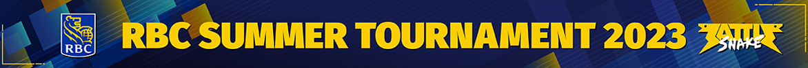

# JNR - BattleSnake Algorithm for the RBC Summer 2023 Tournament 🐍

## Tournament Results: 4th Place 🏆

We're proud to share that our algorithm performed well in the Experienced bracket of RBC Summer 2023 Tournament and secured the **4th place** position in experienced teams! 🥳 The final bracket and game replays are available [here](https://play.battlesnake.com/account/tournament/rbc-summer-2023-experienced#brackets).

## Algorithm Used: Minimax 🤖

We utilized the **minimax algorithm** as the core of our strategy. Minimax is a decision-making algorithm that's commonly used in two-player games. It helps us make optimal decisions by considering possible outcomes of our moves and the opponent's moves. This enables our snake to think several steps ahead and make the best choice in any given situation.

## Scoring Algorithm: Floodfill 🌊

The heart of our scoring system is the **floodfill algorithm**. Floodfill is responsible for evaluating the game board and determining the value of each possible move. It helps us calculate the potential areas of control and the safety of different paths on the board. This information is crucial for our snake to choose the move that maximizes its position while minimizing risk.

## Hosted on Amazon EC2
Hosted on Amazon Elastic Compute Cloud to compute the algorithm and predict multiple steps ahead with optimal response time. 

## How to Run the Algorithm

1. Clone this repository to your local machine.
2. Install the required dependencies using `pip install -r requirements.txt`.
3. Run the `main.py` file to see our algorithm in action at [localhost:80](http://localhost:80).

## Acknowledgments

We'd like to express our gratitude to the organizers of the RBC Summer 2023 BattleSnake Tournament for providing a platform to showcase our algorithm. It was an incredible experience, and we're looking forward to participating in more such events in the future.

If you have any questions, suggestions, or just want to chat about Battlesnake strategies, don't hesitate to contact us.

Happy coding and snake battling! 🚀🐍

**Team JNR**
